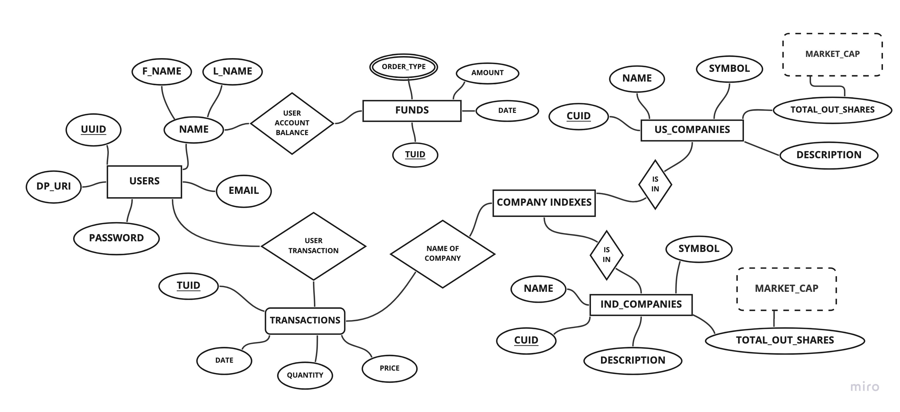

# Finance
Finance is a desktop-native paper trading application that allows users to manage stock portfolios and simulate trades using real-time stock data without the risk of real financial loss. It's perfect for practicing investment strategies and managing virtual portfolios in a safe, realistic environment.

## Project Details 
- Electron.js to compile for the desktops
- SQLlite3 as database interfacing with sql.js module
- React with CDN for the UI and Bulma CSS for the components and style.

### Local Setup
-   Clone the repo
-   `npm install`
-   `npm run start`

### ER Diagram

